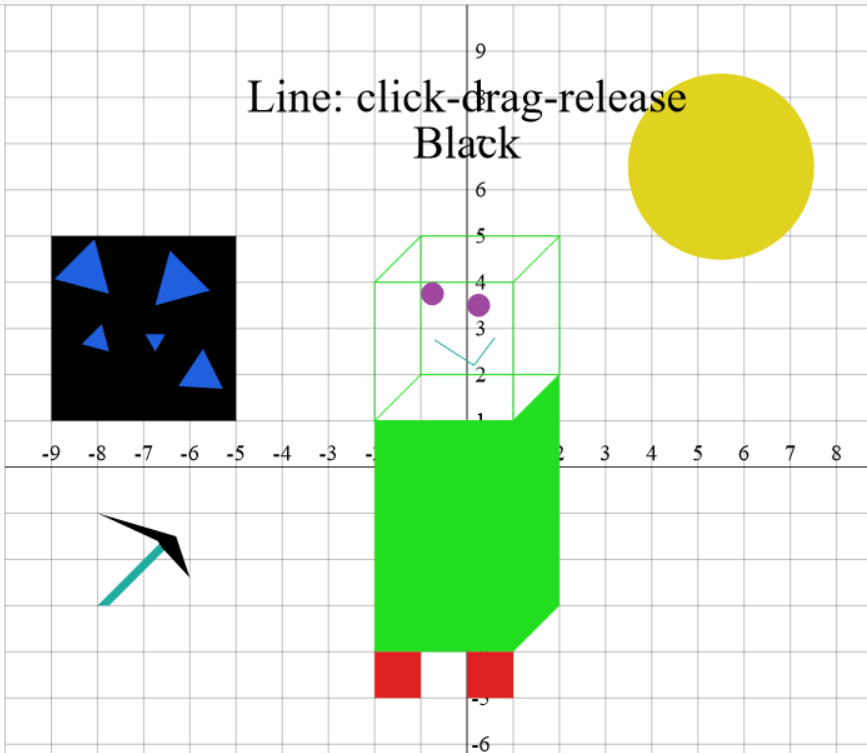
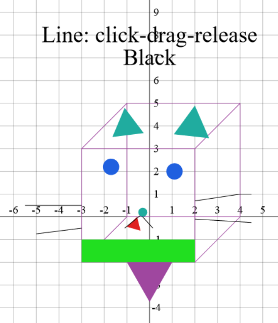

# COMP1100/1130 Assignment 1, Semester 1 2023

In this assignment, you will build a Haskell program that uses the
[CodeWorld API](https://hackage.haskell.org/package/codeworld-api-0.8.1/docs/CodeWorld.html) to draw colourful shapes on the screen.

{:.info-box}
This assignment is worth **10%** of your final grade.

{:.warn-box}
**Deadlines**: 
Sunday April 14, 2023, at 11:00pm Canberra time *sharp*  
Please note that Daylight Savings ends on Sunday 7 April.
Note: Late submissions __will not be marked__ unless you have an
__approved extension__.
Extensions can only be applied for through
[the Extension App](https://apps.powerapps.com/play/e/1bd8c27b-9d7c-eb20-842b-fc9cd96617c4/a/79bb5e31-50f2-4276-a11d-b9dc717bc42d?tenantId=e37d725c-ab5c-4624-9ae5-f0533e486437).
Students with Education Access Plans still need to use this App.

---

## Required Knowledge

If you have finished the [Week 3 lab](), you should be able to attempt Part A.

If you have finished the [Week 4 lab](), you should be able to attempt the majority of the assignment. Some parts require recursion over
lists, which is covered in the [Week 5 lab]().

---

## Overview of Tasks

<table>
  <thead>
    <tr>
      <th> </th>
      <th><strong>COMP1100 Marks</strong></th>
      <th><strong>COMP1130 Marks</strong></th>
    </tr>
  </thead>
  <tbody>
    <tr>
      <td>Task 1: Helper Functions</td>
      <td>20 marks</td>
      <td>10 marks</td>
    </tr>
    <tr>
      <td>Task 2: Rendering Shapes</td>
      <td>45 Marks</td>
      <td>40 Marks</td>
    </tr>
    <tr>
      <td>Task 3: Handling Events</td>
      <td>35 Marks</td>
      <td>30 Marks</td>
    </tr>
    <tr>
      <td>1130 Extensions</td>
      <td>-</td>
      <td>38 Marks</td>
    </tr>
    <tr>
      <td>Report</td>
      <td>0 marks</td>
      <td>2 marks</td>
    </tr>
    <tr>
      <td>Total</td>
      <td>100 marks</td>
      <td>120 marks</td>
    </tr>
  </tbody>
</table>

**Part A** of the assignment requires you to complete Task 1.  
**Part B** of the assignment requires you to complete all other assigned tasks.  
As you complete each task (or even each function within a task),
once your code compiles without errors, you should commit and push your 
work to git with a sensible commit message so your work is safely recorded.

{:.info-box}
**Part A** (Task 1) differs from the rest of the assignment in that you are able to
ask for detailed help from tutors, peers, or other sources of assistance without this
being considered plagiarism. This is to make sure that you have the help you need to
get started on your first programming assignment. We recommend you attempt Part A on your
own before asking for help, so that you have something to discuss. Help from tutors is
best sought through
[drop-in consultations](https://comp.anu.edu.au/courses/comp1100/dropins/) or the
[Ed Discussions forum](https://edstem.org/au/courses/13119) because, during labs, tutors
are usually busy helping with that week's exercises. Usual academic misconduct standards
apply to Part B of the assignment. You may also ask for help from tutors for this later
parts, but the help you will receive will be focused on conceptual
understanding rather than details of the tasks themselves.

---

## Getting Started
1. Fork the assignment repository and create a project for it in
   VSCodium, following the same steps as in [Lab
   2](). The
   assignment repository is at
   <https://gitlab.cecs.anu.edu.au/comp1100/2024s1/2024s1studentfiles/comp1100-2024s1-ass1>.

2. Add **our** version of the repository as a *remote* called
   `upstream`. This allows us to provide additional fixes in the case they
   are required. You do this by doing the following:
   - Go to the command palette in VSCode (or VSCodium) by pressing `Ctrl + Shift + p`
   - Type `git remote`
   - Click **Git: Add Remote**
   - Enter `upstream` into the box for the remote name
   - Put the following URL as the remote url: `https://gitlab.cecs.anu.edu.au/comp1100/2024s1/2024s1studentfiles/comp1100-2024s1-ass1`.

---

## Overview of the Repository

Most of your code will be written to Haskell files in the `src/`
directory. We are using the
[Model-View-Controller](https://en.wikipedia.org/wiki/Model–view–controller)
pattern to structure this assignment. Each file is called a _module_,
and we use modules to group related code together and separate
unrelated code.

### Model.hs

The _Model_ is a data type that describes the state of the running
program. The program will move to new states (new values of type
`Model`) in response to user actions, as defined by the
_Controller_.

### View.hs

The _View_ turns the _Model_ into something that can be shown on the
screen; in this project, that is the CodeWorld `Picture` type.

### Controller.hs

The _Controller_ considers user input (and other events), along with
the current _Model_, and uses that to decide what the new _Model_
should be.

### Other Files

* `tests/ShapesTest.hs` contains some _unit tests_ - simple checks
  that can help to verify that Part A of your program is working correctly.
  You are not required to write your own tests for this assignment, but you
  might find it useful to do so. COMP1130 students might need to modify these
  tests, as explained below.

* `tests/Testing.hs` is a small testing library used by
  `tests/ShapesTest.hs`. You are not required to understand it for
  this assignment.

* `app/Main.hs` ties your functions together into the final program
  that runs. You are not required to understand it.

* `comp1100-assignment1.cabal` tells the cabal build tool how to build
  your assignment. You are not required to understand this file, and
  we will discuss how to use cabal below.

* `Setup.hs` tells cabal that this is a normal package with no unusual
  build steps. Some complex packages (that we will not see in this
  course) need to put more complex code here. You are not required to
  understand it.

## Overview of Cabal

`cabal` is the build tool for Haskell programs and libraries. It
provides several useful commands:

* `cabal v2-build`: Compile your assignment. Note that because of some code
  provided for you by us you will see some warnings about unused variables; you will
  fix these warnings during Task B, so may ignore them for Task A.

* `cabal v2-run shapes`: Build your assignment (if necessary), and run
  the `shapes` program. Note that you will need to enter `Ctrl-C` in your terminal
  to exit the program.

* `cabal v2-repl comp1100-assignment1`: Run the GHCi interpreter over
  your project. This gives you the same ghci environment you use in
  labs, but with the assignment code loaded. (Aside: REPL is the name
  for interactive sessions like GHCi - it stands for read-eval-print
  loop. Many modern languages have REPLs.)

* `cabal v2-test`: Build and run the tests. Tests will abort on the first
  failure, or the first call to a function that is still `undefined`.

{:.info-box}
You should execute these cabal commands in the **top-level directory** of your
project, e.g. `~/comp1100/assignments/Assignment1` (i.e., the directory you are in when you
launch the VSCodium Terminal for your project).

## Interacting with the Program

You use a web browser to interact with the `shapes` program that you
launched with `cabal v2-run shapes`. Once you have completed the
assignment, it will respond to the following actions:

| Action                     | Effect                                              |
|----------------------------|-----------------------------------------------------|
| `Esc` (key)                | Clear the canvas.                                            |
| `1`/`2` (key)                  | Display the sample images.                                      |
| `C` (key)                  | Change colour (of shape to draw).                            |
| `T` (key)                  | Change tool (type of shape to draw).             |
| `Backspace`/`Delete` (key) | Remove the last added shape.                                 |
| `Spacebar` (key)           | When drawing a polygon, finish drawing the polygon, adding it to the canvas. Otherwise, nothing.                                                   |
| `D` (key) | Print the current `Model` to the terminal (useful for testing). |
| Click-drag-release (mouse) | Used to draw various shapes.                                |
| Click (mouse)              | Used to draw various shapes.                                | 

---

## Task 1: Helper Functions (COMP1100: 20 marks, COMP1130: 10 marks)

The easiest way to solve a large problem is often to break it apart
into smaller, easier problems. Programming is the same. In this task
you will write some helper functions that will make future tasks
easier. You can test your implementations by running `cabal v2-test`.

The functions you need to write for this task are:

* `switchColour` in `src/Controller.hs`. This function should return the
  next colour in our set of `ColourChoice`s:

| Argument | Result   |
|----------|----------|
| `Red`    | `Green`  |
| `Green` | `Blue`    |
| `Blue` | `Cyan`     |
| `Cyan`  | `Magenta` |
| `Magenta`   | `Yellow` |
| `Yellow` | `White`  |
| `White` | `Black`   | 
| `Black`  | `Red`    |

* `switchTool` in `src/Controller.hs`. This function implements
  tool-switching, but should not change `Tool` if the user is halfway
  through an operation:

  - If the tool is not holding a point (that is, a `PolyTool` holding 
    the empty list `[]`, or a `Cuboid` tool  holding two `Nothing`s,
    or any other tool holding `Nothing`), select the next 
    tool in the following sequence: `Line` ->
    `Polygon` -> `Rectangle`  -> `Circle` -> `Triangle` -> `Cuboid` -> `Line`.
    The resulting tool should not hold any `Point`s

  - If there is any `Point` stored in the given tool (because it is
    holding a `Just` value or the list in `PolyTool` is non-empty),
    return the argument unchanged.

* `toolToLabel` in `src/View.hs`. This function should return
  instructions for the user on how to use each `Tool`, exactly according to
  the following table:

| Tool               | Label                                                 |
|--------------------|-------------------------------------------------------|
| `LineTool`           | `"Line: click-drag-release"`                        |
| `PolyTool`        | `"Polygon: click 3+ times, then spacebar"`    |
| `RectangleTool`         | `"Rectangle: click-drag-release for opposite corners"` |
| `CircleTool`         | `"Circle: click-drag-release from centre to perimeter"`         |
| `TriangleTool`       | `"Triangle: click-drag-release from centre to corner"`     |
| `CuboidTool`  | `"Cuboid: click-drag-release for opposite corners, then click new top-left corner"`  |

**Hint 1:** At the time this assignment is released, the course will have only
briefly covered lists. You do not need to manipulate lists to write the Part A
functions. Use the blank pattern `_` where you wish to ignore the input, and use
`[]` to match the empty list.

**Hint 2:** If anything is unclear, study the tests in `test/ShapesTest.hs`.

---

**Part A ends here; Part B begins...**

---

## Task 2: Rendering Shapes (COMP1100: 45 marks, COMP1130: 40 marks)

In `src/View.hs`, `modelToPicture` converts your `Model` type into a
CodeWorld `Picture`, so that it can be displayed on the screen. It
currently does not work, because `colourShapesToPicture` is
`undefined`. In this task you will fill in that missing piece,
building up a function to convert the list of type `[ShapeColour]` from your
`Model` into a `Picture`. You can test these functions individually by
using `cabal v2-repl comp1100-assignment1`, using `drawingOf` to show
small pictures on the screen.

{:.info-box}
If you wanted to test functions from `View.hs` e.g. if your prompt shows `*Controller>`,
you can use ghci commands to load the specific module i.e. `:l View`
which should change the ghci prompt accordingly.

You can also test everything as a whole
by launching the program with `cabal v2-run shapes` and pressing the `1` and `2`
keys to show the sample images. The functions you need to write for
this task are all in `src/View.hs`:

* `colourChoiceToColour`: This function turns your `ColourChoice` type
  from the Model into a CodeWorld `Colour`. You should check [the CodeWorld
  documentation](https://hackage.haskell.org/package/codeworld-api-0.8.1/docs/CodeWorld.html#g:3) for information on colours. Most of your `ColourChoice`s should
  map to `Colour`s in the obvious way, e.g. from `Black` to `black`.
  However `Cyan` should be an equal mix of `blue` and `green`, and `Magenta` should
  be an equal mix of `blue` and `red`. You will need to read the documentation to
  find out how to do this.

* `shapeToPicture`: This function turns your `Shape` type into a
  CodeWorld `Picture`. You will need to consider the constructors for
  `Shape` individually, and work out the best way to turn each one
  into a `Picture`. Here are some hints and instructions to help you along:

  - CodeWorld has no function to draw a single line segment. It does
    have a function to draw a line made of multiple segments -
    `polyline`. It also has no function _for_ triangles and cuboids, but it does have functions that can draw these shapes.

  - Polygons, Rectangles, Circles, and Triangles should be drawn as solid 
    (filled) `Picture`s.

  - Many of CodeWorld's functions draw individual shapes centred on
    the origin - `(0, 0)`. You will need to figure out how to slide
    (translate) the generated `Picture` so it shows up where it is
    supposed to go. Drawing diagrams will help. The `abs` function
    might also help - it computes the absolute value of its argument
    (i.e., `abs x == x` if `x > 0`, and `abs x == - x` otherwise).

  - For `Rectangle`s, the two `Point`s correspond to any opposite corners.

  - For `Circle`s, the first `Point` is the _centre_ and the second `Point` is
    on the _perimeter_.

  - The `Triangle` should be _equilateral_ (equal sides and angles). The first `Point`
    should be the centre (the point inside the Triangle equidistant from all three
    corners). The second `Point` should be one of the corners.

  - A `Cuboid` is a three dimensional rectangle (or in this case, a two dimensional
    representation of such a solid). The first two `Points` correspond to opposite corners
    of one of the cuboid's faces. This should be drawn as an unfilled (hollow) rectangle.
    The third `Point` is the top left corner of another rectangle which will have
    equal size and shape to the first one, which is also drawn unfilled. The illusion of
    three dimensions is created by a line connecting the top left corner of the first
    rectangle to the top left corner of the second, and so on for the other corners.     

* `colourShapeToPicture`: This function should render the `Shape` and
  colour it using the `Colour` that corresponds to the given
  `ColourChoice`.

* `colourShapesToPicture`: This function should turn every
  `ShapeColour` in a list into a single `Picture`. You will need
  to recurse over the input list. If you have not yet completed Lab 5,
  you may want to work on other parts of the assignment and come back
  to this. In particular, we will treat `ShapeColours` to the left of the list
  as newer than those on the right of the list, and newer shapes should be drawn over
  the top of older ones.

* Here are the sample images (drawn by my children)
  for you to test your work against:

---

## Task 3: Handling Events (COMP1100: 35 marks, COMP1130: 30 marks)

It is now time to tackle `handleEvent` in
`src/Controller.hs`. CodeWorld calls this function whenever something
interesting happens (like a key press, a pointer press, or a
pointer release). This function is called with two arguments:

* The `Event` that just happened, and
* The current `Model` at the time the `Event` happened.

`handleEvent` then returns a new `Model` for the program to use moving
forward.

(Aside: [Elm](https://elm-lang.org) is a functional programming
language that uses a similar pattern to build front-end web
applications that are compiled to JavaScript.)

Let's trace a simple interaction. The user wants to draw a *red
line* by clicking on the screen at coordinates $$(1, 1)$$ and
releasing the mouse at coordinates $$(2, 2)$$. Atarting at a blank
canvas, the Model will transition as follows, starting with the
initial model:

`Model [] Black (LineTool Nothing)`

- The user presses "C" to change the colour from black to red:

   `Model [] Red (LineTool Nothing)`

- The user presses the mouse button at $$(1, 1)$$, changing the state to

   `Model [] (LineTool (Just (1.0,1.0))) Red`

- The user releases the mouse button at $$(2, 2)$$, changing the state to

   `Model [(Line (1.0,1.0) (2.0,2.0),Red)] (LineTool Nothing) Red`

{:.info-box}
Note that the `Tool` and the `ColourChoice` do not reset to the default values
after a shape has been drawn. However, the `Maybe Point` inside the tool
should revert to `Nothing`.

### Task 3.1: Handling Mouse Input

CodeWorld provides a few different event constructors for mouse input,
but the ones we are interested in here are `PointerPress` for when the user
clicks, and `PointerRelease` for when the user releases the mouse
button.

When a `PointerPress` event arrives, you will need to store it in the
current `Tool`. For most shapes, you will store it
in a `Maybe Point` argument. For `PolyTool`, you will add it to
the list of vertices. For `CuboidTool`, you will need to consider whether it
is the first `PointerPress`, which starts defining the first rectangular face,
or the second `PointerPress`, which defines the top left of the opposite rectangular
face.

When a `PointerRelease` event arrives, for most shapes, this means the end of a
click-drag-release action, so you should construct the appropriate
shape and add it to the `[Shape]` in the `Model`. You should also
remove the starting point from the current `Tool`, so that future
shapes draw properly too. For `PolyTool` we can ignore `PointerRelease`s,
as we will be finishing polygons using the spacebar in Task 3.2. For `CubiodTool`
we need to consider which part of the task of drawing the Cuboid we are performing.

Once you have finished this task for normal input, you may also want to consider
how your program will behave on unexpected input. For example, what should your program
do if it receives two consecutive `PointerPress` inputs without a `PointerRelease` between them?

### Task 3.2: Handling Key Presses

To handle keyboard input, CodeWorld provides a `KeyPress` event. This
is already present in the assignment skeleton, because we have
implemented some keyboard functionality already. In the "Interacting with the Program" section, we listed the full set of keyboard commands that
your program will respond to. You need to implement the missing
functionality for these keys:

| Key                  | Effect                                                           |
|----------------------|------------------------------------------------------------------|
| `C`                  | Change colour (of shape to draw)                                 |
| `T`                  | Change tool (type of shape to draw)                              |
| `Backspace`/`Delete` | Remove the last added shape                                      |
| `Spacebar`           | Finish drawing a polygon, adding it to the canvas. |

If you have made it this far, you should not need to write a lot of
code to implement these. A few hints:

* Think back to Task 1.
* `Backspace`/`Delete` should delete the newest shape, which is on the left of the list.
* `Backspace`/`Delete` with no shapes drawn should not crash the program...
* ... nor should any other unexpected input. Try to test some unexpected cases.

## Task 4: 1130 Extensions (COMP1130 Only: 38 Marks)

COMP1130 students will need to complete *two* of the *four* extensions from the pool below. 
If you attempt more than two, you must indicate in your report which two you wish to be
marked. Otherwise, we will mark the the first extensions you have completed in the order they appear in the code.

If you change the behaviour of colour or tool switching, or tool labelling, from Part A,
you must adjust the tests in `tests/ShapesTest.hs` so that they continue to pass.

*Note:* Extension functionality must be executed through the codeworld API just like 
the rest of the assignment. Interactions should be received through the `handleEvent` 
function, which you will need to modify. If you need to add arguments to any existing
type, please do so after the existing ones, e.g.: `data Model = Model [ColourShape] ColourChoice Tool YourArgument1 YourArgument2 ...`

### Task 4.1: Redefining Colours
You have drawn your picture, but then decide that the green you are using is too bright!
Implement a new tool which allows users to change the definition of the current
`ColourChoice` by keyboard input, adjusting its
[hue, saturation, and lightness](https://www.w3schools.com/colors/colors_hsl.asp). This
should effect all current shapes using this `ColourChoice`, and all future such uses
(until you press `Esc` to revert all changes, or shut the program).

### Task 4.2: Redo
When you press `Esc` or `Backspace` / `Delete` to remove all or part of your picture, you
sometimes regret it! Implement a keypress redo function. You will need to keep a list of
undone shapes so that you can redo them one by one. Your whole picture should appear with
one press of the redo command in the `Esc` case. When you draw any shape on your canvas,
you should empty your redo list.

### Task 4.3: Instant replay
You have finished your masterpiece and want to relive the process. Implement an
animation that, starting with a blank canvas, adds your shapes one by one at a
speed that allows you to see the steps of your creation. You should not be able to
interact with the program while the animation plays, but should be able to do so again
once it finishes. You may ignore any history of undoing and redoing for this task and
simply regard an undone shape as never having been drawn.

### Task 4.4: Preview
It is not satisfying to draw shapes by clicking around a blank screen, with no
visual feedback until you are finished. Implement shape previewing for all shapes,
so that you can see (for example) the line so far after your pointer press but before
your pointer release.

---

## Report (COMP1100: 0 marks, COMP1130 2 marks)

Your report, if you submit one (see below) must be in PDF format, located at the root of
your assignment repository on GitLab and named `Report.pdf`. Otherwise, it
may not be noticed by your marker, or might attract a mark penalty. You should
double-check **on GitLab** that the report has been added to your repository correctly.
No formal word limit is applied for reports but, given the instructions below,
it should be very short.

The report **must** begin with the following items:
* Your name
* Your university ID
* Your laboratory time and tutor

**If you are a COMP1100 student**,
you need to add a short report _only_ if you need to
cite any sources that helped with the completion of your assignment.
In particular, use
[these instructions](https://libguides.anu.edu.au/c.php?g=960102&p=6969607)
if you need to acknowledge the use of generative AI.

**If you are a COMP1130 student**, you _must_ add a short report.
This will explain how to use the functionality implemented in your extensions,
for example which keys to press.
The report will also explain any changes you made to the structure of the code that
was provided to you, for example if you changed the definition of `Model`.
Your comments should be brief and factual, and you do not need to justify your
coding decisions.
You should also cite sources where appropriate as per the instructions above
for COMP1100 students.

---

## Communicating

**Do not** post your code publicly, even for Part A, on Ed Discussions or via
any other means. Posts on Ed Discussions can trigger emails to all students,
depending on how they have configured notifications, so if by
mistake you post your code publicly, others will have access to your
code and you may be held responsible for plagiarism.

Once again, and we cannot stress this enough: **do not post your code
publicly** . If you need help with your code, post it *privately* to the
instructors.

When brainstorming with your friends, **do not view each others' code**
for anything other than Part A. There
might be pressure from your friends, but this is for both your and
their benefit. Anything that smells of plagiarism will be investigated
and there may be serious consequences.

Sharing concepts and sketches is perfectly fine, but sharing should stop
before you risk handing in suspiciously similar solutions.

The use of generative AI tools (e.g. ChatGPT) is permitted in this course,
with appropriate citation.

Course staff will not look at assignment code unless it is posted
**privately** in Ed Discussions, or shared in a drop-in consultation.

Course staff will typically give assignment assistance by asking questions,
directing you to relevant exercises from the labs, or definitions and
examples from the lectures. They will not give direct instructions on how
to write your Part B code, but they will give you more generous help
for questions related to Part A.

## Submission Checklist

Once you have finished your assignment, and preferably 24 hours prior
to the deadline, you should make sure that:

* You have fully read and understand the entire assignment
  specification.
* Your work has been pushed to GitLab. You should check this using your 
  browser by viewing your repository at 
  https://gitlab.cecs.anu.edu.au/uXXXXXXX/comp1100/2024s1/2024s1studentfiles/comp1100-2024s1-ass1 , where XXXXXXX is replaced by your university ID. It is **your 
  responsibility** to confirm that your submission, including for your report, 
  has been successful.
* Your program compiles and runs, including the `cabal v2-test` test suite.
* Your program works on the lab machines - if the program does not
  work on the lab machines, it might fail tests used by the
  instructors.
* You have proof-read and spell-checked your report.
* The report, if submitted, is in PDF format, located at the root of your project on
  GitLab and named `Report.pdf`. That capital `R` is important - Linux
  uses a case-sensitive file system. Otherwise, it may not be marked.
  Check this **on Gitlab** as in some situations operating systems may change the
  formatting of filenames.